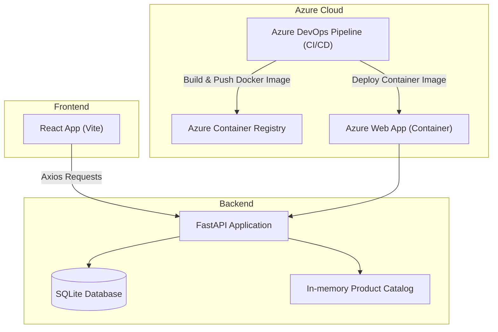

# DevOps Shop — Final Project  
### *IE University — Software Development and Devops*  
Author: **Juliette Janne d’Othée**

---

# 1. Project Overview

**DevOps Shop** is a full-stack e-commerce demo application built for the **DevOps module final project** at IE University.  
It demonstrates the integration of software engineering and cloud operations by implementing:

- A **FastAPI backend**
- A **React (Vite) frontend**
- **CI/CD pipelines** using Azure DevOps Pipelines
- **Docker containerization**
- **Deployment** to Azure Web App for Containers
- A fully functional shop system (users → cart → orders)

The application lets users:

- Create a temporary demo account  
- Automatically receive a cart  
- Browse categories & products (with images)  
- Add items to cart  
- Create and view orders  

All product data is stored **locally in an in-memory catalog**, ensuring reliability with no external API dependencies.

---

# 2. Features

- Full-stack application (React + FastAPI)  
- In-memory product catalog (always available)  
- SQLite database for users, carts, and orders  
- Product browsing with categories and images  
- Automated CI/CD using Azure DevOps Pipelines  
- Container deployment using Azure Web App for Containers  
- Local development with hot reload (uvicorn + Vite)  

---

# 3. System Architecture



# 4. Repository structure 
```text
Devopsfinalproject/
│
├── app/
│   ├── main.py
│   ├── database.py
│   ├── models.py
│   ├── schemas.py
│   ├── services/
│   │   └── external_products.py
│   └── routers/
│       ├── products.py
│       ├── users.py
│       ├── cart.py
│       └── orders.py
│
├── frontend/
│   ├── src/App.jsx
│   └── public/images/
│
├── dockerfile
├── requirements.txt
├── azure-pipelines.yml
└── README.md

```

# 5. Backend (FastAPI)

The backend is a fully functional **FastAPI application** responsible for users, products, carts, and orders.  
It uses an **SQLite database** for persistent storage and an **in-memory product catalog**, ensuring the webapp works even without external APIs.

### Backend Responsibilities

- Create and store users  
- Automatically assign a cart to each user  
- Serve product categories  
- Serve product lists with images  
- Add items to cart  
- Create orders from the cart  


# 5.1 Backend API Endpoints

| Method | Route | Description |
|--------|-------|-------------|
| **POST** | `/users/` | Create a new user |
| **POST** | `/cart/{user_id}` | Create or fetch a cart |
| **POST** | `/cart/{cart_id}/items` | Add product to cart |
| **GET** | `/products/categories` | List all product categories |
| **GET** | `/products/category/{category}` | List all products in a category |
| **POST** | `/orders/{user_id}` | Create order from user cart |
| **GET** | `/orders/user/{user_id}` | Get user order history |


# 6. Frontend (React + Vite)

The frontend is a **React application (Vite)** that interacts with the backend using Axios.  
It provides a clean UI with navigation and real-time updates for cart and order activity.

### Frontend Features

- User creation + saved login  
- Category selection  
- Product grid with images + prices  
- Add-to-cart functionality  
- Order creation  
- Cart and order views  
- Dynamic UI state (loading indicators, errors, active tab highlighting)

### API Communication

All frontend requests use:

```js
const BACKEND = "http://127.0.0.1:8001";
```

This ensures the local frontend communicates with the local backend correctly when developing.

# 7. Docker & Containerization

The backend is fully containerized using Docker for consistency and portability.

Dockerfile summary:
- Based on python:3.12-slim
- Installs all dependencies from requirements.txt
- Uses gunicorn + uvicorn workers in production
- Exposes port 8000
- Azure uses this Dockerfile to build and run the container

Dockerfile used in this project (shown in plain text, no code fencing):
FROM python:3.12-slim
WORKDIR /app
COPY . .
RUN pip install --no-cache-dir -r requirements.txt
CMD ["gunicorn", "-k", "uvicorn.workers.UvicornWorker", "app.main:app", "--bind", "0.0.0.0:8000"]

Container Deployment Flow:
1. Docker image is built in the CI pipeline
2. Image is pushed to Azure Container Registry (ACR)
3. Azure Web App pulls the container image
4. Backend runs live in Azure, fully containerized
```

# 8. CI/CD with Azure DevOps Pipelines 

This project uses a two-stage Azure DevOps pipeline: **Build & Test**, then **Deploy**.

### Continuous Integration (CI)
- Install Python dependencies  
- Run pytest tests  
- Build Docker image  
- Push image to **Azure Container Registry (ACR)**  

### Continuous Deployment (CD)
- Azure Web App pulls the newly built image  
- Uses **AzureWebAppContainer** task for deployment  
- Zero-downtime container updates  

### Azure deployment snippet (plain text)
```yaml
- task: AzureWebAppContainer@1
  inputs:
    azureSubscription: '$(azureSubscription)'
    appName: '$(webAppName)'
    containers: '$(acrName).azurecr.io/$(imageName):$(Build.BuildId)'
---

# 9. Running the Application Locally

### Start the backend (FastAPI)
uvicorn app.main:app --reload --port 8001

Backend URL:  
http://127.0.0.1:8001

---

### Start the frontend (React + Vite)
npm install
npm run dev

Frontend URL:  
http://localhost:5173

---

### Local usage flow
1. Create a user  
2. Cart is automatically created  
3. Select a category  
4. Browse products with images  
5. Add items to cart  
6. Create an order  
7. View your orders  
